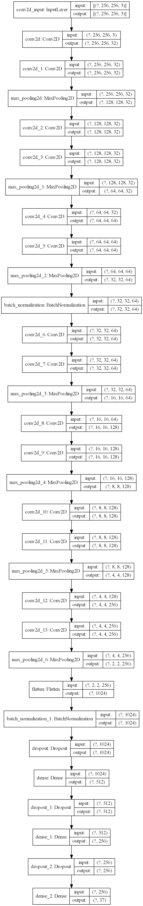
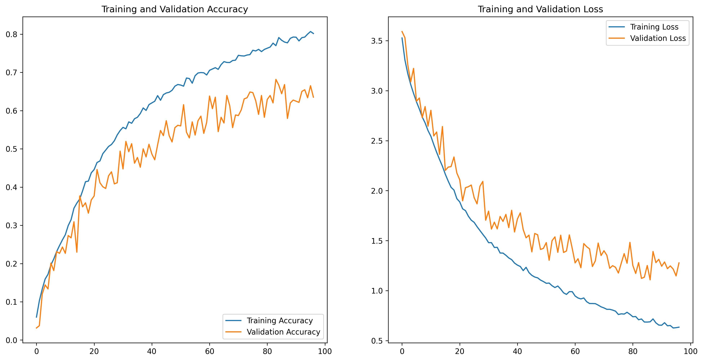
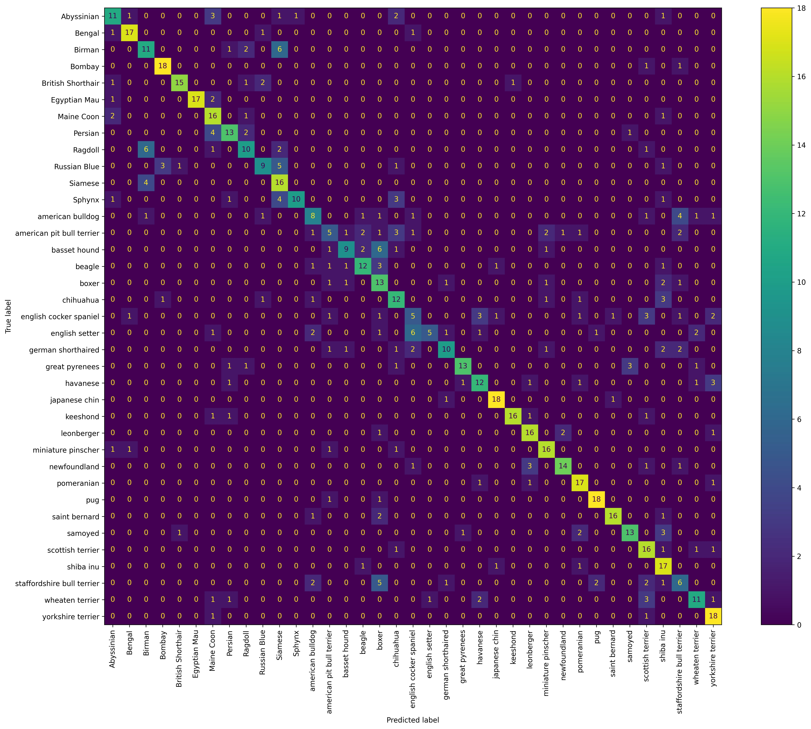

# Pet Image Classification

**Image classification using Deep CNN in tensorflow.keras for Oxford IIIT Pet image dataset.**

## Dataset
The dataset for this project can be downloaded from any of the following links:
* [Visual Geometry Group - University of Oxford](https://www.robots.ox.ac.uk/~vgg/data/pets/)
* [Kaggle](https://www.kaggle.com/tanlikesmath/the-oxfordiiit-pet-dataset)

This dataset consists of 7390 images of pets spanning 37 classes with about 200 images per class. The images vary vastly in size, aspect ratio, pose, lightning, etc. All images in the dataset are within the same folder and the associated class information for each image is present in the file name itself.

## Project Requirements
The external libraries required for running _**Train.ipynb**_ are:
1. numpy
2. matplotlib
3. sklearn/scikit-learn
4. tensorflow (Version 2.3.0 preferred)
5. tqdm (Optional. If unavailable, make changes accordingly)

## Data Preprocessing

- Firstly, the class names of all images were extracted from the image file names to create the target variable.
- The dataset was then divided into **train**, **validation** and **test** datasets. **10% of the entire dataset was used as a test dataset and 10% of the remaining as the validation dataset.**
- Since all images have different sizes and aspect ratios, **the images were loaded with fixed 256*256 resolution with padding**. The padding helps prevent distortion due to stretching or shrinking of images when changing its aspect ratio.
- Keras' **ImageDataGenerator** was used for image augmentation during training with small values for rotation, shift, shear, zoom etc.

## Model
The model used is a deep Convolutional Neural Network and was created using tensorflow.keras Sequential API.

The different layers used in this model are as follows:
- Input 
- Convolution 2D
- Max Pooling 2D
- Batch Normalization
- Dropout
- Dense

The model makes sure of **Early Stopping** and **Tensorboard** callbacks to prevent overfitting and monitor training respectively.

### Structure

### Accuracy and Loss

### Confusion Matrix for Validation data

### Metrics

|                                      | Train  | Validation | Test   |
|--------------------------------------|--------|------------|--------|
| **Count of Records**                 | 5,985  | 666        | 739    |
| **Sparse Categorical Cross-entropy** | 0.7314 | 1.1199     | 1.0731 |
| **Sparse Categorical Accuracy**      | 76.19% | 66.37%     | 66.57% |

&nbsp;

### TensorBoard

Use the command _**tensorboard --logdir tensorboard_logs/fit**_ using the command line from the project's root directory to open the TensorBoard GUI in your browser.

### Notes
- Make sure to update the _**BASE_PATH**_ constant in _**Train.ipynb**_ to reflect the location where your dataset is stored.
- The model was trained on **NVIDIA Geforce GTX 1650 (6 GB)** and the _**Train.ipynb**_ took about 3 hours to run to completion.

> Developed by - Mayur Garg
